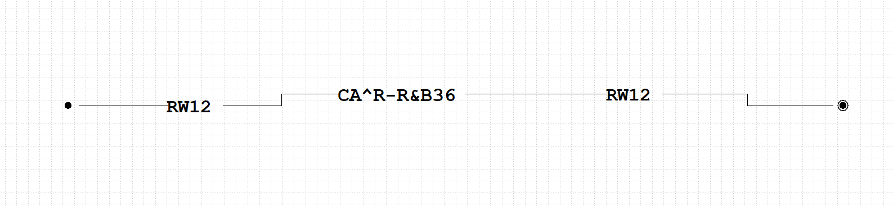
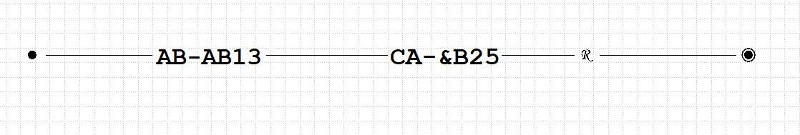

# Отчет по курсовой работе N 2 по курсу
# "Фундаментальная информатика"

Студент группы: M8О-115Б, Самарский Ярослав Вадимович\
Контакты: yaroslav.samarskij&mail.ru \
Работа выполнена: 08.10.2023\
Преподаватель: Чеснов Илья Игоревич

## 1. Тема

Программирование машин Тьюринга при помощи диаграммера

## 2. Цель работы

Составить программу машины Тьюринга используя диаграммер, выполняющую заданное действие над словами, записанными на ленте.

## 3. Задание

Вариант 26. Вычисление поразрядной конъюнкции двух двоичных чисел (слова одинаковой длины).

## 4. Оборудование

Процессор: Intel Core i5-8265U & 8x 3.9GH\
ОП: 7851 Мб\
НМД: 1024 Гб\
Монитор: 1920x1080

## 5. Программное обеспечение

Операционная система семейства: **linux (ubuntu)**, версия **18.10 cosmic**\
Интерпретатор команд: **bash**, версия **4.4.19**.\
Система программирования: **--**, версия **--**\
Редактор текстов: **emacs**, версия **25.2.2**\
Утилиты операционной системы: **--**\
Прикладные системы и программы: **--**\
Местонахождение и имена файлов программ и данных на домашнем компьютере: **--**

## 6. Идея, метод, алгоритм решения задачи

1. Скопировать первое число на место третьего
2. Перевернуть третье число
3. Провести поразрядную конъюнкцию второго и третьего числа
4. Перевернуть третье число

## 7. Сценарий выполнения работы

Подпрограмма копирования первого числа на место третьего:
1. Перейти к последнему символу первого числа, заменить его на другой символ (чтобы запомнить, что его уже копировали), скопировать его после второго числа и один пробел
2. Копировать оставшиеся символы первого числа, помечая их скопированными
3. После копирования вернуть первое число в начальное состояние
4. Перевернуть третье число

Подпрограмма переворота чисел
1. Запоминаем первый необработанный символ
2. Идём к последнему необработанному символу
3. Запоминаем последний, записываем первый символ, помечая что символ обработан (0 -> &, 1 -> !)
4. Возвращаемся к первому символу
5. Заменяем его на последний, помечая что символ обработан (0 -> &, 1 -> !)
6. Возвращаемся к пункту 1, пока не обработаются все чимволы
7. Убираем пометки об обработке (&  -> 0, ! -> 1)

Подпрограмма убирания пометок об обработке числа (&  -> 0, ! -> 1)
Перебирает все символы и заменяет их на цифры

Подпрограмма конъюнкции двух чисел (Основная программа)
1. Копируем первое число на место третьего
2. Перворачиваем третье число
3. Ставим каретку между вторым и третьим числом
4. Двигаемся влево до первого необработанного символа
5. Запоминаем его и помечаем обработанным
6. Двигаемся вправо до первого необработанного числа
7. Производим конъюнкцию значения в памяти и в ячейке
8. Помечаем символ обработанным
9. Возвращаемся к пункту один, пока не дойдём до пробела
10. Убирем пометки со второго и третьего числа
11. Переворачиваем третье число


## 8. Распечатка протокола


- Подпрограмма копировния первого числа на место третьего
  
```
1010101 11111 -> 1010101 11111 1010101
1 100 -> 1 100 1
```

- Подпрограмма убирания пометок об обработке числа (&  -> 0, ! -> 1)
  
```
!&& -> 100
!&!&!&!!!!&&!&! -> 101010111100101
```

- Подпрограмма переворота чисел
  
```
1011 -> 1101
100 -> 001
```

- Подпрограмма конъюнкции числа и перевернутого числа (ответ на месте второго числа и перевернут)
  
```
11100 11100 -> 11100 00100
11100 11101 -> 11100 00101
```

- Подпрограмма конъюнкции двух чисел
  
```
11100 10101 -> 11100 10100
11100 11001 -> 11100 11000
```
- Основная программа
  
```
11100 10101 -> 11100 10101 10100
11100 11001 -> 11100 11001 11000
```

## 9. Дневник отладки

| № | Лаб. или дом. | Дата       | Время     | Событие                                                        | Действие по исправлению      | Примечание         |
|---|---------------|------------|-----------|----------------------------------------------------------------|------------------------------|--------------------|
|1  | Дом           | 06.10.2023 | 17:50     | Запустил ДТ, он не скомпилировался                             | Исправил конфликт путей      | Частая ошибка      |
|2  | Дом           | 06.10.2023 | 19:24     | Возник баг: при использовании инструкции L диаграммер крашится | Учёл этот случай в диаграмме | Баг в диаграммере  |

## 10. Замечания автора по существу работы

Очень интересная работа, но все диграммеры тьюринга очень не удобные и периодически крашатся. Несмотря на это, возможность использовать подпрограммы и графический интерфейс намного удобнее чем писать правила для МТ вручную

## 11. Выводы

Диаграммер Тьюринга позволяет проще разрабатывать программы для Машины Тьюринга

